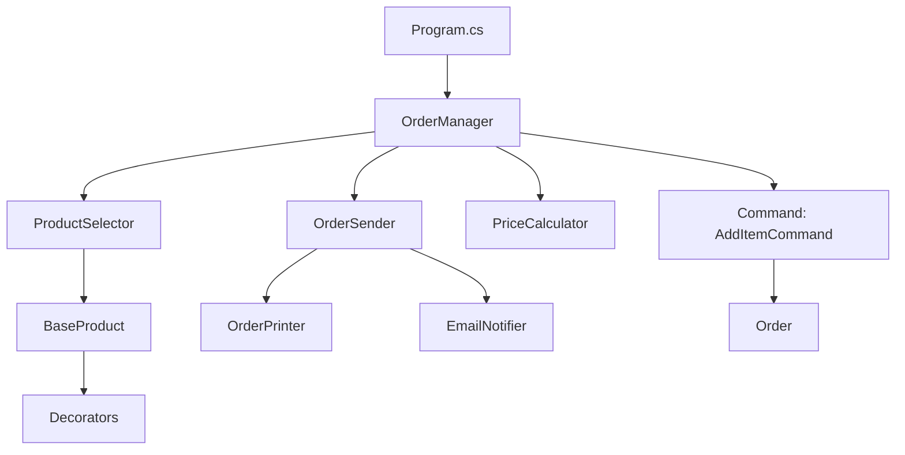

# ARCHITECTURE.md

## Overview

This document describes the architecture of the project, outlining the main components, their responsibilities, and the interactions between them. The goal is to provide a clear understanding of the system structure for both developers and stakeholders.

---

## Table of Contents

1. [Introduction](#introduction)
2. [High-Level Architecture](#high-level-architecture)
3. [Main Components](#main-components)
4. [Data Flow](#data-flow)
5. [Technologies Used](#technologies-used)
6. [Deployment Architecture](#deployment-architecture)
7. [Future Improvements](#future-improvements)S
8. [Diagrams](#diagrams)
9. [Conclusion](#conclusion)

---

## Introduction

**Project Name**: GuroDemo
**Purpose**: A demonstrative platform for learning and applying Design Patterns in C#
**Core Features**:

* Order management
* Product selection
* Dynamic discount and decoration application
* Modular architecture with support for classic design patterns

---

## High-Level Architecture

**Architecture Style**: Modular Monolith
**Main Layers**:

* **Presentation**: Console UI (user interaction)
* **Business Logic**: Order processing, customer/product logic, pricing strategy
* **Persistence**: Simulated in-memory (product and order lists)

**Communication**: Direct class interactions via references (no distributed messaging).

---

## Main Components

1. **Program.cs**
   Entry point of the application. Initializes and coordinates core services.

2. **OrderManager**
   Orchestrates the full ordering process, including interaction with `ProductSelector`, `OrderSender`, and pricing strategies.

3. **ProductSelector**
   Handles user interaction for product selection and configuration.

4. **OrderSender (Singleton + Observer)**
   Manages order dispatch and notifies registered observers (e.g., printing, email).

5. **CustomerBuilder / ProductBuilder (Builder Pattern)**
   Incremental and validated object creation.

6. **PriceCalculator (Strategy Pattern)**
   Applies pricing strategies based on customer type.

7. **Product Decorators**
   Dynamically enhance products with extra features (warranty, packaging, insurance).

8. **Command Pattern**
   Encapsulates operations like adding items to an order into executable commands.

---

## Data Flow

1. The user selects a product and specifies quantity.
2. Product is decorated dynamically based on user input.
3. An `OrderItem` is created and added to the `Order` via a command.
4. The `PriceCalculator` applies the relevant pricing strategy.
5. `OrderSender` notifies its observers (e.g., `OrderPrinter`, `EmailNotifier`).

---

## Technologies Used

* **Language**: C#
* **Runtime**: .NET 6+
* **Patterns**: Builder, Strategy, Singleton, Observer, Decorator, Command, Factory Method
* **Tools**: Visual Studio / VS Code

---

## Deployment Architecture

* **App Type**: Console
* **Hosting**: Local (development/test only)
* **Environments**: No production deployment; can be extended for it

---

## Future Improvements

* Add persistence with a database or file storage
* Extend to GUI (e.g., WPF or web-based frontend)
* Introduce automated testing (unit, integration)
* Structured logging (e.g., Serilog or NLog)
* Potential refactor into microservices (as an advanced exercise)

---

## Diagrams

---

## Conclusion

The architecture of the GuroDemo project was designed as a practical exercise in software design principles and pattern implementation. Each component follows the single responsibility principle and is structured to support extensibility and modularity.
